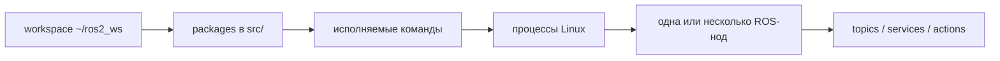

# Шпаргалка по ROS 2 workflow для EyeCar

Целевая система: Raspberry Pi 4 Model B, Ubuntu Server 24.04 ARM64,
ROS 2 Jazzy. Workspace на Raspberry Pi: `~/ros2_ws`.

Официальная документация:

- [ROS 2 Jazzy: создание пакета](https://docs.ros.org/en/jazzy/Tutorials/Beginner-Client-Libraries/Creating-Your-First-ROS2-Package.html)
- [ROS 2 Jazzy: Python publisher/subscriber](https://docs.ros.org/en/jazzy/Tutorials/Beginner-Client-Libraries/Writing-A-Simple-Py-Publisher-And-Subscriber.html)
- [ROS 2 Jazzy: топики](https://docs.ros.org/en/jazzy/Tutorials/Beginner-CLI-Tools/Understanding-ROS2-Topics/Understanding-ROS2-Topics.html)
- [ROS 2 Jazzy: nodes](https://docs.ros.org/en/jazzy/Tutorials/Beginner-CLI-Tools/Understanding-ROS2-Nodes/Understanding-ROS2-Nodes.html)

## 1. Модель ROS 2 без лишней магии



- **Workspace** — каталог, в котором лежат исходники и результаты сборки.
- **Package** — единица ROS-проекта с `package.xml`, кодом и зависимостями.
- **Executable** — имя, которое указывается после имени пакета в `ros2 run`.
- **Process** — обычный запущенный процесс Linux.
- **Node** — участник ROS-графа. Один процесс может содержать несколько нод.
- **Publisher** отправляет сообщения определённого типа в topic.
- **Subscriber** получает сообщения из topic того же типа.
- **Executor** вызывает таймеры и callbacks нод, когда приходят сообщения или
  наступает время таймера.

Команда имеет форму:

```bash
ros2 run <имя_пакета> <имя_executable>
```

`ros2 run` не запускает ноду по её ROS-имени. Он находит установленный
executable пакета и запускает его `main()`. Уже код внутри `main()` создаёт одну
или несколько нод.

## 2. Что происходит в текущем EyeCar

```text
терминал                         браузер
ros2 run eyecar_teleop          http://<ip>:8080
  keyboard_teleop                    │
        │                       /eyecar_web_bridge
        └──────────────┬─────────────┘
                       ▼
             /cmd_vel (Twist)
                       │
                       ▼
       /eyecar_serial_driver (user-сервис)
                       │
               USB Serial 115200
                       │
                       ▼
              Arduino Mega 2560
                       │
           двигатель S3 / руль S2
```

`keyboard_teleop` создаёт только ноду `/keyboard_teleop` и публикует команды.
Нода `/eyecar_serial_driver` запускается независимо через
`eyecar-base.service`, постоянно владеет serial-портом и подписана на
`/cmd_vel`. Поэтому терминальный teleop можно закрыть и снова открыть без
переподключения Arduino. Arduino не является ROS-нодой: это контроллер с
отдельной прошивкой и простым serial-протоколом.

`cmd_vel_monitor` — третий, необязательный subscriber. Он запускается отдельным
процессом и только показывает сообщения `/cmd_vel`:

```bash
ros2 run eyecar_teleop cmd_vel_monitor
```

## 3. Зачем выполнять `source`

```bash
source /opt/ros/jazzy/setup.bash
source ~/ros2_ws/install/setup.bash
```

Первая команда добавляет в окружение системную установку ROS 2 Jazzy. Вторая
добавляет собранные локальные пакеты из `~/ros2_ws`. Без второй команды новый
терминал может не найти пакет или продолжить видеть старую сборку.

На EyeCar обе строки уже добавлены в `~/.bashrc`, но при диагностике их полезно
выполнить явно.

## 4. Создание первой собственной Python-ноды

Ниже учебный пакет `rover_state`, который публикует строку в `/rover/state`.
Для первой проверки `std_msgs/String` достаточно. Когда состав состояния станет
понятен, лучше перейти на собственное сообщение или
`diagnostic_msgs/DiagnosticArray`.

Создать каркас пакета на Raspberry Pi:

```bash
source /opt/ros/jazzy/setup.bash
cd ~/ros2_ws/src
ros2 pkg create rover_state \
  --build-type ament_python \
  --license MIT \
  --dependencies rclpy std_msgs
```

Создать `~/ros2_ws/src/rover_state/rover_state/state_publisher.py`:

```python
import json

import rclpy
from rclpy.node import Node
from std_msgs.msg import String


class RoverStatePublisher(Node):
    def __init__(self) -> None:
        super().__init__('rover_state_publisher')
        self.publisher = self.create_publisher(String, '/rover/state', 10)
        self.timer = self.create_timer(0.5, self.publish_state)

    def publish_state(self) -> None:
        message = String()
        message.data = json.dumps({
            'controller_connected': True,
            'mode': 'manual',
        })
        self.publisher.publish(message)


def main(args=None) -> None:
    rclpy.init(args=args)
    node = RoverStatePublisher()
    try:
        rclpy.spin(node)
    except KeyboardInterrupt:
        pass
    finally:
        node.destroy_node()
        if rclpy.ok():
            rclpy.shutdown()


if __name__ == '__main__':
    main()
```

В `~/ros2_ws/src/rover_state/setup.py` добавить executable в
`entry_points['console_scripts']`:

```python
entry_points={
    'console_scripts': [
        'state_publisher = rover_state.state_publisher:main',
    ],
},
```

Зависимости `rclpy` и `std_msgs` уже будут добавлены в `package.xml` командой
`ros2 pkg create`.

## 5. Сборка и запуск пакета

Собирать нужно из корня workspace, а не из `src`:

```bash
cd ~/ros2_ws
source /opt/ros/jazzy/setup.bash
rosdep install --from-paths src --ignore-src -r -y
colcon build --symlink-install --packages-select rover_state
source install/setup.bash
ros2 run rover_state state_publisher
```

Во втором SSH-терминале:

```bash
source /opt/ros/jazzy/setup.bash
source ~/ros2_ws/install/setup.bash

ros2 node list
ros2 node info /rover_state_publisher
ros2 topic list -t
ros2 topic info /rover/state --verbose
ros2 topic echo /rover/state
ros2 topic hz /rover/state
```

Полезные команды:

```bash
# Показать пакеты workspace
colcon list

# Показать executable конкретного пакета
ros2 pkg executables rover_state

# Пересобрать только изменённый пакет
colcon build --symlink-install --packages-select rover_state

# Собрать пакет и его зависимости до него
colcon build --symlink-install --packages-up-to rover_state
```

При `--symlink-install` обычные изменения Python-файлов часто видны без новой
сборки. После изменения `setup.py`, `setup.cfg`, `package.xml`, имён модулей или
добавления executable пакет нужно пересобрать и снова выполнить
`source install/setup.bash`.

## 6. Что публиковать в состоянии ровера

Полезный минимальный набор для будущего сообщения:

- время сообщения `stamp`;
- есть ли связь с Arduino;
- возраст последней команды управления;
- текущая команда газа и руля;
- активировался ли watchdog;
- последнее подтверждение Arduino;
- напряжение батареи, только если оно реально измеряется отдельным входом;
- ошибки serial и состояние камеры.

Не записывать в состояние выдуманные физические скорость, угол или заряд. Для
них сначала нужны датчики и калибровка.

## 7. Web-панель и USB-камера

Основной способ просмотра и управления — открыть на ноутбуке или телефоне в той
же сети:

```text
http://172.16.1.182:8080
```

Текущий IP выдан сетью и может измениться. Панель содержит WebRTC-видео,
состояние ROS-моста, список топиков и WASD-управление. Сочетания клавиш работают,
потому что браузер сообщает отдельные события нажатия и отпускания; например,
при `W+D` одновременно публикуются `linear.x=0.18` и `angular.z=-0.85`.

Сервисы на Raspberry Pi:

```bash
systemctl --user status eyecar-base eyecar-web eyecar-video eyecar-rosbridge
journalctl --user -u eyecar-video -f
journalctl --user -u eyecar-rosbridge -f
```

Чтобы user-сервисы стартовали сразу при загрузке, до первого SSH-входа:

```bash
sudo loginctl enable-linger mavxa
```

Подробная схема и порты описаны в [WEB_PANEL.md](WEB_PANEL.md).

### Резервный просмотр через `ffplay`

На EyeCar сейчас обнаружена камера `Web-camera DQ5MF3F1`:

- видеопоток: `/dev/video0`;
- служебный интерфейс: `/dev/video1`;
- MJPEG 1280x720 при 30 FPS поддерживается камерой;
- пользователи `mavxa` и `griftf` состоят в группе `video`;
- `ffmpeg` и `v4l2-ctl` установлены на Raspberry Pi;
- локальный компьютер уже имеет `ffplay`.

На основном компьютере также установлена короткая команда:

```bash
eyecar-video
```

Её исходник находится в `scripts/eyecar-video`, а
`~/.local/bin/eyecar-video` указывает на него. Скрипт отключает SSH ControlMaster
и TTY, поэтому старый Kitty-сеанс не влияет на группы и не повреждает бинарный
видеопоток. Профиль просмотра настроен на минимальную задержку: MJPEG
640x360@30 без перекодирования, немедленная отправка пакетов и отбрасывание
опоздавших кадров. Проверенный поток 1280x720@30 занимал около 30.1 Мбит/с,
а текущий 640x360@30 — около 10.5 Мбит/с.

Если добавляется новый пользователь, один раз выполнить на Raspberry Pi и
перезайти по SSH:

```bash
sudo usermod -aG video <user>
exit
```

После нового входа проверить права и режимы:

```bash
ssh eyecar
id
v4l2-ctl --list-devices
v4l2-ctl -d /dev/video0 --list-formats-ext
```

В выводе `id` должна быть группа `video`. Захват одного JPEG 1280x720 от имени
`mavxa` уже проверен. Затем одной командой на основном компьютере открыть поток
через зашифрованный SSH-канал:

```bash
ssh eyecar 'ffmpeg -nostdin -hide_banner -loglevel warning \
  -f v4l2 -input_format mjpeg -framerate 30 -video_size 1280x720 \
  -i /dev/video0 -an -c:v copy -f mjpeg -' \
| ffplay -hide_banner -loglevel warning \
  -fflags nobuffer -flags low_delay -framedrop -f mjpeg -
```

Здесь Raspberry Pi не перекодирует видео: готовые MJPEG-кадры камеры передаются
через SSH. Это экономит CPU и не требует открывать дополнительный сетевой порт.
Остановить просмотр можно `Q` в окне `ffplay` или `Ctrl+C` в терминале.

Если `getent group video` уже показывает пользователя, но `ssh eyecar 'id'`
ещё не содержит `video`, используется старое постоянное SSH-соединение,
созданное до изменения групп. Закрыть старый `kitten ssh eyecar` и подключиться
заново. Для немедленного запуска без закрытия текущей сессии:

```bash
ssh eyecar "sg video -c 'ffmpeg -nostdin -hide_banner -loglevel warning \
  -f v4l2 -input_format mjpeg -framerate 30 -video_size 1280x720 \
  -i /dev/video0 -an -c:v copy -f mjpeg -'" \
| ffplay -hide_banner -loglevel warning \
  -fflags nobuffer -flags low_delay -framedrop -f mjpeg -
```

Проверка одного кадра на Raspberry Pi:

```bash
ffmpeg -f v4l2 -input_format mjpeg -video_size 1280x720 \
  -i /dev/video0 -frames:v 1 /tmp/eyecar-camera.jpg
```

Этот `ffplay`-поток существует отдельно от ROS 2. Если изображение понадобится
алгоритмам ровера, следующим этапом можно запустить V4L2 camera node, публиковать
`sensor_msgs/msg/Image` в ROS-топик и подключать к нему CV-ноды.

## 8. Короткий рабочий цикл

```text
изменить код
    ↓
проверить зависимости в package.xml
    ↓
добавить/проверить console_scripts в setup.py
    ↓
cd ~/ros2_ws
    ↓
colcon build --symlink-install --packages-select <package>
    ↓
source install/setup.bash
    ↓
ros2 run <package> <executable>
    ↓
ros2 node list / ros2 topic echo / ros2 topic hz
```

Частые ошибки:

- `Package '<name>' not found` — workspace не собран или не выполнен
  `source ~/ros2_ws/install/setup.bash`.
- `No executable found` — нет записи в `console_scripts`, ошибочно указано имя
  executable или пакет не пересобран после изменения `setup.py`.
- Нода есть, а сообщений нет — проверить publisher/subscriber, точное имя topic,
  одинаковый тип сообщения и `ros2 topic info <topic> --verbose`.
- Изменения не появились — пересобрать пакет, заново выполнить `source` и
  убедиться, что запущен пакет из нужного workspace.
